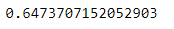
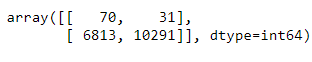
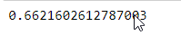

# Overview of Credit Risk Analysis

### The Analysis of credit risk involves unbalanced classifications. Low risk customers outnumber the high risk loans. The imbalanced-learn and scikit-learn libraries will be used to build models and evaluate them with resmapling to predict credit risk.
### The credit card credit dataset from LendingClub will be analyzed with two oversampling and one undersampline algorithms and the results from machine learning models will be compared. Next two ensemble models will be used and the performance evaluated.

 

## Results: Deliverable 1

 

-   RandomOverSampler 
    
-       Accuracy score
     

-       Confusion matrix
     

-       Imbalanced classification report
     

 
 
-   SMOTE 
    
       Accuracy score
 

-       Confusion matrix
     

-       Imbalanced classification report
     

 
 

-   ClusterCentroids
        
   
-       Accuracy score

     

-       Confusion matrix

     

-       Imbalanced classification report

    

